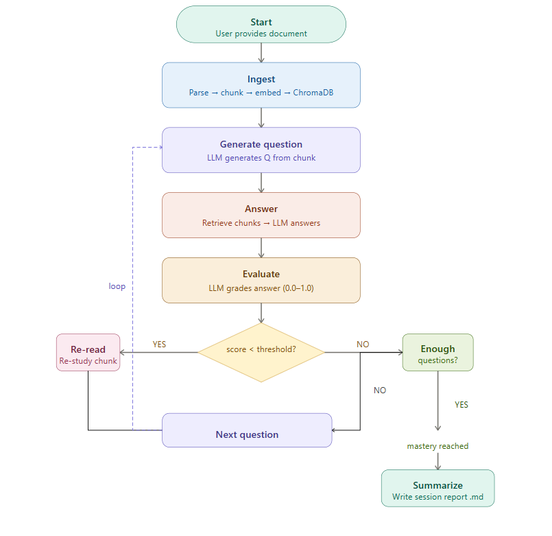

# Adaptive Study Agent

A single-agent self-directed learning system built with LangGraph that ingests documents, quizzes itself, evaluates its own answers, and iterates until mastery.

---

## Motivation and Conceptual Link to MOSAIC

MOSAIC (a separate research project) tests whether 12 specialist agents sharing a vector database improves rare-condition classification -- collective knowledge at scale. This project is the single-agent version of the same question: can one agent use retrieval to improve its own understanding iteratively? The feedback loop here is what Phase 1C of MOSAIC implements collectively across 12 agents.

The connection is conceptual and motivational. There is no shared infrastructure, codebase, or data pipeline between this project and MOSAIC.

---

## Architecture

The agent operates as a LangGraph state machine with conditional branching. After evaluating each answer, the agent decides whether to re-read weak material, continue to the next question, or finalize the session.



---

## Tech Stack

| Component        | Technology                    | Purpose                                      |
|------------------|-------------------------------|----------------------------------------------|
| Agent framework  | LangGraph                     | Stateful loops with conditional branching     |
| LLM              | Claude Sonnet 4 (Anthropic)   | Question generation, answering, evaluation    |
| Embeddings       | OpenAI text-embedding-3-small | Text chunk embeddings                         |
| Vector store     | ChromaDB (local, embedded)    | No Docker required                            |
| Document parsing | PyMuPDF (fitz)                | PDF support                                   |
| UI               | Gradio                        | Web interface and Hugging Face Spaces deploy  |
| Package manager  | uv                            | Dependency management                         |

---

## Setup

**1. Install dependencies**

```bash
uv sync
```

**2. Configure environment variables**

Create a `.env` file in the project root:

```
ANTHROPIC_API_KEY=sk-ant-...
OPENAI_API_KEY=sk-...
```

The Anthropic key powers the LLM (question generation, answering, evaluation). The OpenAI key is used only for embeddings.

**3. Add documents**

Place PDF or TXT files in `data/documents/`.

---

## Usage

### Command line

```bash
# Run with a document
uv run python src/main.py --doc data/documents/attention_is_all_you_need.pdf

# Override the mastery threshold (default: 0.75)
uv run python src/main.py --doc data/documents/myfile.pdf --threshold 0.8

# Persist the ChromaDB collection between runs
uv run python src/main.py --doc data/documents/myfile.pdf --persist
```

### Gradio web interface

```bash
uv run python app.py
```

The web interface allows you to upload a document, configure the mastery threshold, start a study session, and view the resulting session report from the browser.

### Running tests

```bash
uv run pytest tests/ -v
```

---

## Configuration

The following constants in `src/graph/edges.py` control the study loop:

| Parameter            | Default | Description                                  |
|----------------------|---------|----------------------------------------------|
| MASTERY_THRESHOLD    | 0.75    | Score needed to skip re-read                 |
| MIN_QUESTIONS        | 10      | Minimum questions before mastery check       |
| MAX_REREAD_CYCLES    | 3       | Max re-read attempts per weak chunk          |

The mastery threshold can also be overridden at runtime via the `--threshold` flag or the Gradio slider.

---

## Output Format

Each session produces a Markdown report in `output/session_reports/`:

```markdown
# Study Session Report
Date: 2026-03-16
Document: attention_is_all_you_need.pdf

## Summary
- Questions asked: 14
- Questions correct (score >= 0.75): 11
- Final mastery score: 0.81
- Re-read cycles triggered: 3

## Weak Areas
- Multi-head attention computation
- Positional encoding formula

## Q&A Log
### Q1
Question: What is the purpose of the scaling factor in dot-product attention?
Answer: ...
Score: 0.9
...
```

---

## Author

**Halima Akhter**
PhD Candidate in Computer Science
Specialization: ML, Deep Learning, Bioinformatics
GitHub: [github.com/Mituvinci](https://github.com/Mituvinci)
