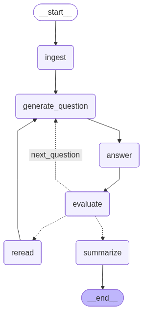

# Adaptive Study Agent

A **two-model LLM self-examination simulation** built with **LangGraph**, **Claude (Anthropic)**, and **GPT-4o-mini (OpenAI)**. The agent reads any document you provide and runs a fully autonomous study loop — no human answers anything.

**How the two models collaborate:**
- **GPT-4o-mini** generates comprehension questions from document chunks (temperature 0.7 — creative) and evaluates the answers against the source material (temperature 0.0 — deterministic)
- **Claude Sonnet** answers the questions using RAG retrieval from ChromaDB (temperature 0.3 — balanced)
- **OpenAI text-embedding-3-small** handles document chunking and embedding into ChromaDB only — not used for reasoning

The purpose is to **probe where Claude's understanding of the document breaks down** — GPT acts as the examiner, Claude as the student. When Claude scores below the mastery threshold, the agent re-reads the weak chunk and tries again.

The output is a structured session report revealing Claude's weak areas within your document — useful for identifying conceptually dense or underrepresented sections in any text.

Applicable to **any domain** — ML papers, medical literature, legal documents, textbooks — anything in PDF or TXT format.

---

## Research Connection

This is a standalone extended example project inspired by ongoing research on multi-agent knowledge systems. The core idea — using retrieval-augmented self-evaluation to surface knowledge gaps — is the single-agent version of a feedback mechanism explored at scale in that research. There is no shared infrastructure or data pipeline between the two.

---

---

## Architecture

The agent operates as a LangGraph state machine with conditional branching. After evaluating each answer, the agent decides whether to re-read weak material, continue to the next question, or finalize the session.




---

## Tech Stack

| Component        | Technology                    | Purpose                                              |
|------------------|-------------------------------|------------------------------------------------------|
| Agent framework  | LangGraph                     | Stateful loops with conditional branching            |
| Examiner LLM     | GPT-4o-mini (OpenAI)          | Question generation (0.7) + evaluation (0.0)         |
| Student LLM      | Claude Sonnet 4 (Anthropic)   | Answering questions via RAG (0.3)                    |
| Embeddings       | OpenAI text-embedding-3-small | Document chunking and embedding into ChromaDB only   |
| Vector store     | ChromaDB (local, embedded)    | No Docker required                                   |
| Document parsing | PyMuPDF (fitz)                | PDF support                                          |
| UI               | Gradio                        | Web interface and Hugging Face Spaces deploy         |
| Package manager  | uv                            | Dependency management                                |

---

## Setup

**1. Install dependencies**

```bash
uv sync
```

**2. Configure environment variables**

Create a `.env` file in the project root:

```
ANTHROPIC_API_KEY=sk-ant-...
OPENAI_API_KEY=sk-...
```

The Anthropic key powers the LLM (question generation, answering, evaluation). The OpenAI key is used only for embeddings.

**3. Add documents**

Place PDF or TXT files in `data/documents/`.

---

## Usage

### Command line

```bash
# Run with a document
uv run python src/main.py --doc data/documents/attention_is_all_you_need.pdf

# Override the mastery threshold (default: 0.75)
uv run python src/main.py --doc data/documents/myfile.pdf --threshold 0.8

# Persist the ChromaDB collection between runs
uv run python src/main.py --doc data/documents/myfile.pdf --persist
```

### Gradio web interface

```bash
uv run python app.py
```

The web interface allows you to upload a document, configure the mastery threshold, start a study session, and view the resulting session report from the browser.

### Running tests

```bash
uv run pytest tests/ -v
```

---

## Configuration

The following constants in `src/graph/edges.py` control the study loop:

| Parameter            | Default | Description                                  |
|----------------------|---------|----------------------------------------------|
| MASTERY_THRESHOLD    | 0.75    | Score needed to skip re-read                 |
| MIN_QUESTIONS        | 10      | Minimum questions before mastery check       |
| MAX_REREAD_CYCLES    | 3       | Max re-read attempts per weak chunk          |

The mastery threshold can also be overridden at runtime via the `--threshold` flag or the Gradio slider.

---

## Output Format

Each session produces a Markdown report in `output/session_reports/`:

```markdown
# Study Session Report
Date: 2026-03-16
Document: attention_is_all_you_need.pdf

## Summary
- Questions asked: 14
- Questions correct (score >= 0.75): 11
- Final mastery score: 0.81
- Re-read cycles triggered: 3

## Weak Areas
- Multi-head attention computation
- Positional encoding formula

## Q&A Log
### Q1
Question: What is the purpose of the scaling factor in dot-product attention?
Answer: ...
Score: 0.9
...
```

---

## Author

**Halima Akhter**
PhD Student in Computer Science
Specialization: ML, Deep Learning, Bioinformatics
GitHub: [github.com/Mituvinci](https://github.com/Mituvinci)
